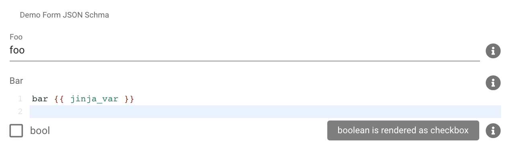

# Appendix

## Jinja2

Jinja2 is a template language for python.

It supports a ton of features, we will focus on the basics here.

```jinja
{# comment #}

{{ variable }}


do some content

some content with {{ variable }}



……do somthing with {{ element }}


{# use filters on elements with | #}
{{ variable | upper }} {# make a string uppercase #}
{{ variable | regex_replace('foo', 'bar', ignorecase=True) }} {# search foo and replace it with bar #}
{# more filters see below #}
```

### Filter

See this [list](https://jinja.palletsprojects.com/en/2.11.x/templates/#builtin-filters) to checkout all built in filters

Additionally we support some custom filters:

- `regex_search` \_searches a string, returns a list of found elements

```jinja
{# search for foo in foobar and returns foo #}
{{ 'foobar' | regex_search('(foo)') }}

{# search for f[a-z] in foobar and returns fo #}
{{ 'foobar' | regex_search('(f\w)') }}

{# will return empty if it cannot find a match #}
{{ 'foo' | regex_search('(foobar)') }}

{# optional parameters are case insensitive search and multiline mode, will return bar#}
{{ 'foo\nBAR' | regex_search("^bar", multiline=True, ignorecase=True) }}
```

- `regex_replace` _search a string and replace it_

```jinja
{# search for foo and replace it with bar #}
{{ 'foobar' | regex_replace('foo', 'bar') }} {# output: barbar #}

{# ignorecase is supported as well #}
{{ 'FOObar' | regex_replace('foo', 'bar', ignorecase=True) }} {# output: barbar #}

{# grouping and referencig is supported as well #}
{{ 'FOObar' | regex_replace('^foo(\w+)^', '\\1\\1', ignorecase=True) }} {# output: barbar #}
```

- more to come

### Ressources

- [Jinja2 Documentation](https://jinja.palletsprojects.com/en/2.11.x/)
- and many more are found with your preferred web search engine ;)

## JSON Form

JSON Schema is used for rendering forms from providers and tasks in the frontend.

Example of JSON Form:

```JSON
{
  "$id": "https://neops.io/schema/example.json",
  "$schema": "http://json-schema.org/draft-07/schema#",
  "title": "Demo Form JSON Schma",
  "type": "object",
  "required": [
    "foo",
    "bar"
  ],
  "properties": {
    "foo": {
      "title": "Foo",
      "type": "string",
      "description": "Foo rendered as normal input field"
    },
    "bar": {
      "title": "Bar",
      "type": "string",
      "description": "Bar rendered as editor with syntax highliting for jinja2",
      "x-display": "editor-jinja2"
    },
    "bool": {
      "title": "bool",
      "type": "boolean",
      "description": "boolean is rendered as checkbox"
    }
  }
}
```

Will render this form:



Fields:

- `$id`: _global identifier, used if multiple forms are renderd on one page_
- `$schema`: \_reference to the json schema for validation (use `http://json-schema.org/draft-07/schema#`)
- `title`: _form title or on sub-element field title_
- `type`: _globally it's always an object (which holds sub-elements in properties), on fields it defines all common data types (string, boolean, number and more)_
- `required`: _used for validation, which fields are required_
- `properties`: _sub-elements_
- `x-display`: _used to affect form rendering_

Form more information checkout the ressources below.

### Ressources

- [JSON Form Documentation](https://json-schema.org/learn/getting-started-step-by-step.html)
- [Datastructure to JSON Form](https://www.jsonschema.net/home)
- [Demo of Vutify JSON Form](https://koumoul-dev.github.io/vuetify-jsonschema-form/latest/?example=basic)

## TextFSM

TextFSM is used to parse semi-formated data.

Example of TextFSM Template:

```
# Chassis value will be null for single chassis routers.
Value Filldown Chassis (.cc.?-re.)
Value Required Slot (\d+)
Value State (\w+)
Value Temp (\d+)
Value CPUTemp (\d+)
Value DRAM (\d+)
Value Model (\S+)

# Always starts in 'Start' state.
Start
  ^${Chassis}
  # Record current values and change state.
  # No record will be output on first pass as 'Slot' is 'Required' but empty.
  ^Routing Engine status: -> Record RESlot

# A state transition was not strictly necessary but helpful for the example.
RESlot
  ^\s+Slot\s+${Slot}
  ^\s+Current state\s+${State}
  ^\s+Temperature\s+${Temp} degrees
  ^\s+CPU temperature\s+${CPUTemp} degrees
  ^\s+DRAM\s+${DRAM} MB
  # Transition back to Start state.
  ^\s+Model\s+${Model} -> Start

# An implicit EOF state outputs the last record.
```

### Ressources

- [TextFSM Documentation](https://github.com/google/textfsm/wiki/TextFSM)
