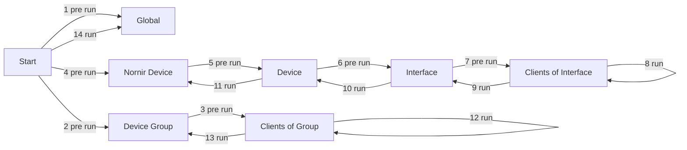

# Providers

Providers are the classes used by tasks. They provide functionality and expose configuration parameters through JSON Forms to the user. Providers are running the tasks.

This way, a provider can be written (like a function) in a generic and reusable way, while a task contains configuration which is passed to the provider.

Neops comes with a set of providers out of the box, see [built in providers](provider_overview.md).

## Properties

They have some base properties that describe the provider.

On which entity and how the provider has to be executed:

- `run_on`: _the task is executed on this entity_
- `run_on_strict`: _describes the allowed input entities, if strict only elements of the run_on entity are allowed, otherwise the run_on entity is resolved from the given entity (eg. interface 1,2 belongs to device A, interface 3,4 belongs to device B. if run_on is set to DEVICE and run_on_strict is False: interface 1 is given the task runs on device A. vice verca if run on is set to INTERFACE and run_on_strict is False: device B is given the task runs on interface 3 and 4. if run_on_strict is True only run_on entity is supported)_
- `run_on_all_if_empty`: _use with caution_ - _runs on all elements if none is given (mostly used for facts providers)_

```python
run_on = RunOnEnum.DEVICE
run_on_strict = True
run_on_all_if_empty = False
```

Properties to describe the provider/task:

- `provider_type`: _representing the four different [task](#tasks) types_
- `description`: _describe what the provider will do_

```python
provider_type = ProviderTypeEnum.FACTS
description = ""
```

Properties to describe which input parameters are required for the task instance and in the runs:

- `json_schema`: _[JSON Form](appendix.md#json-form) for rendering the task instance form in the frontend_
- `run_input_json_schema`: _[JSON Form](appendix.md#json-form) for rendering the form before the task runs_

```python
json_schema = {}
run_input_json_schema = {}
```

## Run cycle

The run cycle definition is implemented in each neops provider. Steps can be left empty, but the order is immutable.

Use **pre run** and **run** steps to prepare and execute.

| #   | Step                            | Description                                                                                                                 |
| --- | ------------------------------- | --------------------------------------------------------------------------------------------------------------------------- |
| 1   | Pre run on global               | All task arguments are passed                                                                                               |
| 2   | Pre run on device group         | Per device group. Device groups are resolved and passed                                                                     |
| 3   | Pre run on clients of group     | Per client of group. Runs in context of group (here, groups are locations). Device group and client are resolved and passed |
| 4   | Pre run on nornir device        | Per nornir device. Nornir device is resolved and passed                                                                     |
| 5   | Pre run on device               | Per device. Device is resolved and passed                                                                                   |
| 6   | Pre run on interface            | Per interface of device. Device and interface are resolved and passed                                                       |
| 7   | Pre run on clients of interface | Per client of interface. Device, nornir device an dinterface are resovled and passed                                        |
| 8   | Run on clients of interface     | Run equivalent for #7                                                                                                       |
| 9   | Run on interface                | Run equivalent for #6                                                                                                       |
| 10  | Run on device                   | Run equivalent for #5                                                                                                       |
| 11  | Run on nornir device            | Run equivalent for #4                                                                                                       |
| 12  | Run on clients of group         | Run equivalent for #3                                                                                                       |
| 13  | Run on device group             | Run equivalent for #2                                                                                                       |
| 14  | Run on global                   | Run equivalent for #1                                                                                                       |



## Run Options

!> **Coming with version 1.0** We are standardizing last things under the hood to fulfill our **backwards compatibility commitment** according to [SemVer](semver.org). Stay tuned!

## Result handling

!> **Coming with version 1.0** We are standardizing last things under the hood to fulfill our **backwards compatibility commitment** according to [SemVer](semver.org). Stay tuned!

## Methods

### pre_run_global

This method is executed at the beginning of the task in a global manner. It doesn't matter on which entity the task runs, this method is run exactly once.

```python
def pre_run_global(
    self,
    task_input_kwargs: Dict = None,
    execute_on: List = [],
    dry_run: bool = True
) -> Any:
    return None
```

parameters:

- `task_input_kwargs`: _keyworded or named arguments passed from the task run form_
- `execute_on`: _list of entity elements where the task should be run_
- `dry_run`: _defines if no changes should be applied (especially for configuration tasks)_

### run

this method is executed once globally if run_on is set to GLOBAL or per device for the other entities.

```python
    def run(self, **kwargs) -> Any:
        return None
```

parameters:

- `kwargs`: _differs on the runing type_

If the task is run on devices with [nornir](https://nornir.readthedocs.io/) as task engine the parameters are:

- `task`: _the nornir task_
- `dry_run`: _defines if no changes should be applied (especially for configuration tasks)_
- `execute_on`: _list of entity elements where the task should be run_
- `**task_input_kwargs`: _resolved keyworded or named arguments passed from the task run form_

If the task is run globally the parameters are:

- `dry_run`: _defines if no changes should be applied (especially for configuration tasks)_
- `**task_input_kwargs`: _resolved keyworded or named arguments passed from the task run form_

If you need to have access to the task instance parameters they are stored under the property `task_kwargs` and can be used like:

```python
facts_key = self.task_kwargs.get('facts_key')
```

### process_host_result

Processes the return value of the `run` method on every device.

```python
def process_host_result(
    self,
    result: Any
) -> None:
    pass
```

If you need to have access to the task instance or input values, those can be accessed as follows:

```python

facts_key = self.task_kwargs.get('facts_key')

task_input_kwargs = self.run_args.task_input_kwargs
execute_on = self.run_args.execute_on
dry_run = self.run_args.dry_run
```

### process_global_result

Processes the return value of the `run` method of every device as nornir MultiResult if run_on is not GLOBAL. Otherwise it’s the direct result of the `run` method.

```python
def process_global_result(
    self,
    result: Any
) -> None:
    pass
```

## Inheritance

!> **Coming with version 1.0** We are standardizing last things under the hood to fulfill our **backwards compatibility commitment** according to [SemVer](semver.org). Stay tuned!
