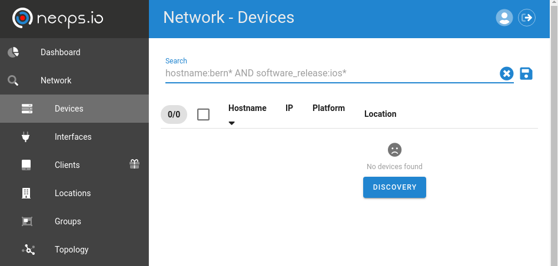
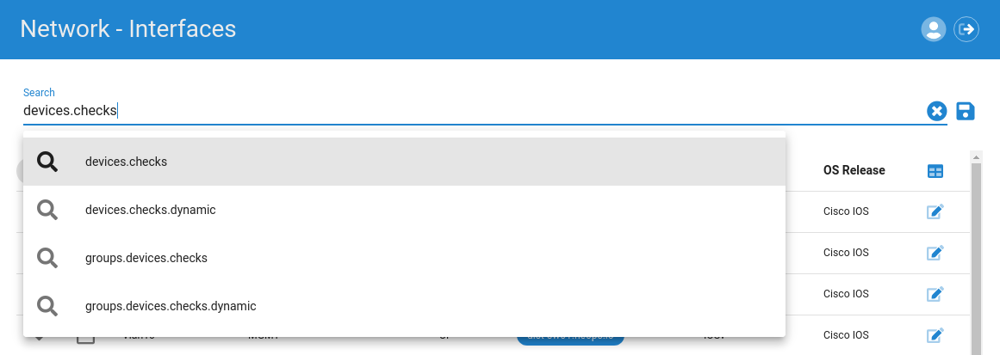

# Usage

## Frontend

!> **Coming with version 1.0** We are standardizing last things under the hood to fulfill our **backwards compatibility commitment** according to [SemVer](semver.org). Stay tuned!

### Network Search

The network search view gives you an overview over the entities "Location/Group", "Devices" and "Interfaces". All three views display the search related elements. In addition, the topology of the searched network elements is displayed.



Relevant data regarding the entities (facts, checks and global data) is searchable via the search bar.



#### Search Terms

Search terms are composed by [key]: [value] and put together by the logical operators AND/OR (optionally NOT).
Or additionally full text searches are possible as well.

##### Keys

Possible keys are suggested. They are composed hierarchically over the full data structure. For example if you have facts on devices stored under the key of VLANs like the following:

```json
  "vlans": [
    {
      "name": "default",
      "status": "active",
      "vlan_id": "1",
      "interfaces": [
        "Gi0/1",
      ]
    },
    {
      "name": "MGMT",
      "status": "active",
      "vlan_id": "10",
      "interfaces": [
        "Gi0/1",
        "Gi0/2"
      ]
    },
    {
      "name": "CLIENT-A",
      "status": "active",
      "vlan_id": "100",
      "interfaces": [
        "Gi0/1",
        "Gi3/0",
        "Gi3/1"
      ]
    },
    {
      "name": "CLIENT-B",
      "status": "active",
      "vlan_id": "101",
      "interfaces": [
        "Gi0/1",
        "Gi3/2",
        "Gi3/3"
      ]
    },
  ],
```

You are able to filter the elements where one device has VLAN XY configured by using the key `devices.facts.vlans.name` (`devices` = access to the device elements, `facts` = access to the facts of the device, `vlans` access to the facts key, `name` key within the facts).

Then, the search term to get all elements where VLAN `CLIENT-A` is configured will be `devices.facts.vlans.name: CLIENT-C`

If you are on the interface view, with this search all interfaces of the filtered devices are show. But this is probably not what you want.
To search only the interfaces where the specific VLAN is configured, then you need more specific information, like VLAN facts on the interfaces.
As an example on Interface `GigabitEthernet0/1`:

```json
  "vlans": [
    {
      "name": "default",
      "status": "active",
      "vlan_id": "1",
    },
    {
      "name": "MGMT",
      "status": "active",
      "vlan_id": "10",
    },
    {
      "name": "CLIENT-A",
      "status": "active",
      "vlan_id": "100",
    },
    {
      "name": "CLIENT-B",
      "status": "active",
      "vlan_id": "101",
    },
  ],
```

Or on `GigabitEthernet3/1`:

```json
  "vlans": [
    {
      "name": "CLIENT-A",
      "status": "active",
      "vlan_id": "101",
    },
  ],
```

With the interface related search term `interfaces.facts.vlans.name: CLIENT-A` you will get interfaces Gi0/1, Gi3/0 and Gig3/1. And in device and location view, you'd get the related devices or locations with interfaces that match the above search.

##### Values

A `*` can be uses as a wildcard.
For exact matches use double quotes `"`.

Strings within facts in a key name with `ip` in it, are tried to be stored as ip addresses. This gives you the ability to search within ip addresses in a subnet. Entering the network and subnet length in double quotes like `"192.0.2.16/28` will give you all elements that contains a ip address in the range 192.0.2.16 - 192.0.2.31 in the result set.

##### Operators

Operators `AND`, `OR` and `NOT` have to be uppercase. Parentheses can be used for logical ordering.

##### Ressources

[elastic query string search documentation](https://www.elastic.co/guide/en/elasticsearch/reference/current/query-dsl-query-string-query.html)

#### Saved Searches

To easily reuse complex search terms, you can save and name them with the disk sign on the right.

To find the saved search term, enter the defined name. Saved searches are per default added in front of the term with the `AND` operator added.

### <a name="frontend-tasks">Tasks</a>

!> **Coming with version 1.0** We are standardizing last things under the hood to fulfill our **backwards compatibility commitment** according to [SemVer](semver.org). Stay tuned!

### Execute Tasks

!> **Coming with version 1.0** We are standardizing last things under the hood to fulfill our **backwards compatibility commitment** according to [SemVer](semver.org). Stay tuned!

### Discovery

!> **Coming with version 1.0** We are standardizing last things under the hood to fulfill our **backwards compatibility commitment** according to [SemVer](semver.org). Stay tuned!

## Facts

Facts in neops.io are flexible data structures stored as JSON in the database. Every fact/data structure is stored under a given key. Facts are collected by fact tasks.

They are representing a state at a given time. And facts are not only facts, they can represent states as well.

Examples of facts:

- Software release running on a network device
- A configuration parameter eg. the log server
- State of a routing protocol neighborship
- Information from peripheral systems, like CMDB and others
  - Information about service SLA
  - Information about physical device access

Facts can be stored on every entity known in neops.io
(see [Entities](architecture.md#entities))

Data structures of facts are **searchable**.

They are collected by [FACTS Tasks](#tasks) and they need a key to be stored.

!> Choose the facts key wisely, because if the key contains ip (pattern `*.ip.*`) an ip address (yes ipv6 as well) or an empty string is expected. otherwise the content is skipped for searching.

Example

```JSON
  "napalm_facts": {
    "fqdn": "dsw01.neops.io",
    "model": "IOSv",
    "uptime": 2547840,
    "vendor": "Cisco",
    "hostname": "sw01",
    "os_version": "vios_l2 Software (vios_l2-ADVENTERPRISEK9-M), Version 15.2(CML_NIGHTLY_20180619)FLO_DSGS7, EARLY DEPLOYMENT DEVELOPMENT BUILD, synced to  V152_6_0_81_E",
    "serial_number": "93F8UGICVB2",
    "interface_list": [
      "GigabitEthernet0/0",
      "GigabitEthernet0/1",
      "GigabitEthernet0/2",
      "GigabitEthernet0/3",
      "GigabitEthernet1/0",
      "GigabitEthernet1/1",
      "GigabitEthernet1/2",
      "GigabitEthernet1/3",
      "GigabitEthernet2/0",
      "GigabitEthernet2/1",
      "GigabitEthernet2/2",
      "GigabitEthernet2/3",
      "GigabitEthernet3/0",
      "GigabitEthernet3/1",
      "GigabitEthernet3/2",
      "GigabitEthernet3/3",
      "Vlan10"
    ]
  },
  "vlans": [
    {
      "name": "default",
      "status": "active",
      "vlan_id": "1",
      "interfaces": [
        "Gi0/1",
        "Gi0/2",
        "Gi0/3",
        "Gi1/2",
        "Gi1/3",
        "Gi2/0",
        "Gi2/1",
        "Gi2/2",
        "Gi2/3",
        "Gi3/0",
        "Gi3/1",
        "Gi3/2",
        "Gi3/3"
      ]
    },
    {
      "name": "MGMT",
      "status": "active",
      "vlan_id": "10",
      "interfaces": []
    },
    {
      "name": "CLIENT-A",
      "status": "active",
      "vlan_id": "100",
      "interfaces": []
    },
    {
      "name": "CLIENT-B",
      "status": "active",
      "vlan_id": "101",
      "interfaces": []
    },
    {
      "name": "CLIENT-C",
      "status": "active",
      "vlan_id": "102",
      "interfaces": []
    },
    {
      "name": "fddi-default",
      "status": "act/unsup",
      "vlan_id": "1002",
      "interfaces": []
    },
    {
      "name": "token-ring-default",
      "status": "act/unsup",
      "vlan_id": "1003",
      "interfaces": []
    },
    {
      "name": "fddinet-default",
      "status": "act/unsup",
      "vlan_id": "1004",
      "interfaces": []
    },
    {
      "name": "trnet-default",
      "status": "act/unsup",
      "vlan_id": "1005",
      "interfaces": []
    }
  ],
```

## Tasks

neops.io tasks are performing actions (collecting facts, make changes, interact with peripheral systems).

There are currently 4 types of tasks implemented

- CONFIGURE - _configure network devices_
- FACTS - _collecting facts_
- CHECK - _check states based on facts_
- EXECUTE - _generic task for troubleshooting purpose, interact with peripheral systems (if it's not related to facts) or others_

All Tasks are based on [providers](#providers) that execute the tasks. A task is a parameterized provider instance.

### Generic task parameters

Generic task parameters are used to describe the task itself and how it is acting.

#### Description

Set an appropriate Description to the task, that describe its functionality.

#### Provider name and module

This is a reference to the provider that is used to instantiate and run the task.

#### Input parameters (JSON scheme for running the task)

This describes additional input parameters as [JSON Schema](https://json-schema.org/learn/getting-started-step-by-step.html). They are required to run a task.

Before executing a task, a web Form is rendered based on the task JSON schema to get the required input values.

For more information how to build such a JSON Schema look in [Appendix under JSON Form](appendix.md#json-form)

#### Pre and post running tasks

For some tasks, like configurations or checks, it's essential to have accurate (actual) data. They are based on current facts or states, which should be collected in front of the task. Such supporting tasks can be referenced as pre- or post-running tasks

**Other parameters are provider specific**

## Implemented Providers

Providers implemented in neops.io: for what they are, how they work and how they can be used

### DeviceJinjaConfigureProvider

This provider renders a Jinja2 template and applies the rendered configuration to the device.

Parmeters:

- `apply`: _how to apply the configuration (scp to copy and merge the configuration, cli to paste the configuration over the ssh/cli session)_
- `template`: _the content of the jinja2 template which will be rendered_

#### Template

In the template you can access pre-populated variables and if required facts of other elements.

- `input`: _the input variable maps the content of the form before running a task (JSON schema for running the task)_
- `device`: _the device variable maps the device where the task is running on, including the facts of the device on `device['facts']`_
- `neops`: _the neops object brings methods to access to other elements over the [neops.io search](#search)_
  - `neops.search_devices(query)`: _returns a list of devices found by the search query_
  - `neops.search_interfaces(query)`: _returns a list of interfaces found by the search query_
  - `neops.search_device_groups(query)`: _returns a list of groups found by the search query_

For more information on how to build a Jinja2 template, have a look at [Appendix under Jinja2](appendix.md#jinja2)

### InterfaceJinjaConfigureProvider

This provider renders a Jinja2 template and applies the rendered configuration to the device. The selected interfaces are returned as a list in the `interfaces` variable for iterating.

Parameters:

- `apply`: _how to apply the configuration (scp to copy and merge the configuration, cli to paste the configuration over the ssh/cli session)_
- `template`: _the content of the jinja2 template which will be rendered_

#### Template

In the template you can access on pre-populated variables and if required facts of other elements.

- `input`: _the input variable maps the content of the form before running a task (JSON schema for running the task)_
- `interfaces`: _the selected interfaces of the device where the task is running, including the facts of the interfaces`_
- `device`: _the device variable maps the device where the task is running, including the facts of the device on `device['facts']`_
- `neops`: _the neops object brings methods to access to other elements over the [neops.io search](#search)_
  - `neops.search_devices(query)`: _returns a list of devices found by the search query_
  - `neops.search_interfaces(query)`: _returns a list of interfaces found by the search query_
  - `neops.search_device_groups(query)`: _returns a list of groups found by the search query_

_Example_

```jinja

interface {{ iface.name }}
 description {{ input.new_description }}

```

For more information how to build a Jinja2 template, have a look at [Appendix under Jinja2](appendix.md#jinja2)

### DeviceNTCTemplateFactsProvider

This provider parses the output of a command against the [ntc (network to code) TestFSM](https://github.com/networktocode/ntc-templates) templates.

Parameters:

- `command`: _the command that produces the output to be parsed by the TextFSM template_
- `facts_key`: _the key where the structed data is stored_

### DeviceTextFSMFactsProvider / InterfaceTextFSMFactsProvider

This provider parses the output of a command against your own [TestFSM](https://github.com/google/textfsm/wiki/TextFSM) templates.

Parameters:

- `command`: _the command which one produces the output to be parsed by the TextFSM template_
- `facts_key`: _the key where the structed data is stored_
- `textfsm`: _the TextFSM template_

For more information on how to build a TextFSM template, have a look at [Appendix under TextFSM](appendix.md#textfsm)

### DeviceRegexFactsProvider / InterfaceRegexFactsProvider

This provider parses the output of a command against a regular expression.

Parmeters:

- `facts_key`: _the key where the structed data is stored_
- `command`: _the command that produces the output to be parsed by the regular expression_
- `regex`: _the regular expression_
- `match_keys`: _the keys where the matched regex groups are stored_

If you use OR operators in your regular expression, which shouldn't be stored on a matched key, use `(?:true|false)` instead.

To test your regular expressions check out [Pythex](https://pythex.org/)

#### Example

Parse a Cisco `show version` command

Regex:

```regex
Software, ([^\s]+) .*Version ([^\s\,]+).*Configuration register is 0x(\d+)
```

Match Keys (order is important):

- `sw`: _matches on the first group_
- `version`: _matches on the first group_
- `confregister`: _matches on the first group_

Results in those data structure:

```JSON
{
  "sw": "IOS",
  "version": "15.2.(8)",
  "confreg": "102"
}
```

## Providers

Providers are python classes. They are running the task.

### Properties

They have some base properties that describe the provider.

On which entity and how the provider has to be executed:

- `run_on`: _the task is executed on this entity_
- `run_on_strict`: _describes the allowed input entities, if strict only elements of the run_on entity are allowed, otherwise the run_on entity is resolved from the given entity (eg. interface 1,2 belongs to device A, interface 3,4 belongs to device B. if run_on is set to DEVICE and run_on_strict is False: interface 1 is given the task runs on device A. vice verca if run on is set to INTERFACE and run_on_strict is False: device B is given the task runs on interface 3 and 4. if run_on_strict is True only run_on entity is supported)_
- `runon_all_if_empty`: _use with caution_ - _runs on all elements if none is given (mostly used for facts providers)_

```python
run_on = RunOnEnum.DEVICE
run_on_strict = True
run_on_all_if_empty = False
```

Properties to describe the provider/task:

- `provider_type`: _representing the four different [task](#tasks) types_
- `description`: _describe what the provider will do_

```python
provider_type = ProviderTypeEnum.FACTS
description = ""
```

Properties to describe which input parameters are required for the task instance and in the runs:

- `json_schema`: _[JSON Form](appendix.md#json-form) for rendering the task instance form in the frontend_
- `run_input_json_schema`: _[JSON Form](appendix.md#json-form) for rendering the form before the task runs_

```python
json_schema = {}
run_input_json_schema = {}
```

### Methods

#### pre_run_global

This method is executed at the beginning of the task in a global manner. It doesn't matter on which entity the task runs, this method is run exactly once.

```python
def pre_run_global(
    self,
    task_input_kwargs: Dict = None,
    execute_on: List = [],
    dry_run: bool = True
) -> Any:
    return None
```

parameters:

- `task_input_kwargs`: _keyworded or named arguments passed from the task run form_
- `execute_on`: _list of entity elements where the task should be run_
- `dry_run`: _defines if no changes should be applied (especially for configuration tasks)_

#### run

this method is executed once globally if run_on is set to GLOBAL or per device for the other entities.

```python
    def run(self, **kwargs) -> Any:
        return None
```

parameters:

- `kwargs`: _differs on the runing type_

If the task is run on devices with [nornir](https://nornir.readthedocs.io/) as task engine the parameters are:

- `task`: _the nornir task_
- `dry_run`: _defines if no changes should be applied (especially for configuration tasks)_
- `execute_on`: _list of entity elements where the task should be run_
- `**task_input_kwargs`: _resolved keyworded or named arguments passed from the task run form_

If the task is run globally the parameters are:

- `dry_run`: _defines if no changes should be applied (especially for configuration tasks)_
- `**task_input_kwargs`: _resolved keyworded or named arguments passed from the task run form_

If you need to have access to the task instance parameters they are stored under the property `task_kwargs` and can be used like:

```python
facts_key = self.task_kwargs.get('facts_key')
```

#### process_host_result

Processes the return value of the `run` method on every device.

```python
def process_host_result(
    self,
    result: Any
) -> None:
    pass
```

If you need to have access to the task instance or input values, those can be accessed as follows:

```python

facts_key = self.task_kwargs.get('facts_key')

task_input_kwargs = self.run_args.task_input_kwargs
execute_on = self.run_args.execute_on
dry_run = self.run_args.dry_run
```

#### process_global_result

Processes the return value of the `run` method of every device as nornir MultiResult if run_on is not GLOBAL. Otherwise it’s the direct result of the `run` method.

```python
def process_global_result(
    self,
    result: Any
) -> None:
    pass
```

### Inheritance

!> **Coming with version 1.0** We are standardizing last things under the hood to fulfill our **backwards compatibility commitment** according to [SemVer](semver.org). Stay tuned!

## nornir Task Resolvers

!> **Coming with version 1.0** We are standardizing last things under the hood to fulfill our **backwards compatibility commitment** according to [SemVer](semver.org). Stay tuned!

## Checks

!> **Coming with version 1.0** We are standardizing last things under the hood to fulfill our **backwards compatibility commitment** according to [SemVer](semver.org). Stay tuned!
