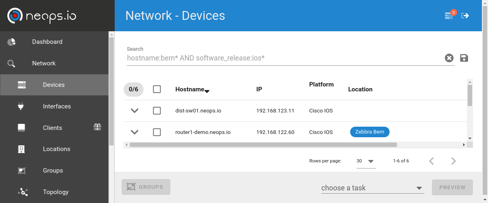
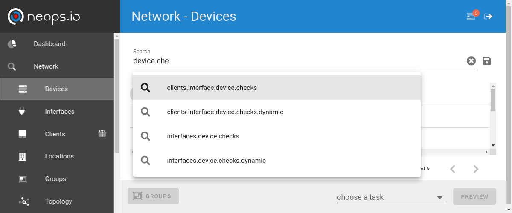

# Usage

!> **Coming with version 1.0** We are standardizing last things under the hood to fulfill our **backwards compatibility commitment** according to [SemVer](semver.org). Stay tuned!

## Network Search

The network search view gives you an overview over the entities "Location/Group", "Devices" and "Interfaces". All three views display the search related elements. In addition, the topology of the searched network elements is displayed.



Relevant data regarding the entities (facts, checks and global data) is searchable via the search bar.



### Search Terms

Search terms are composed by [key]: [value] and put together by the logical operators AND/OR (optionally NOT).
Or additionally full text searches are possible as well.

#### Keys

Possible keys are suggested. They are composed hierarchically over the full data structure. For example if you have facts on devices stored under the key of VLANs like the following:

```json
  "vlans": [
    {
      "name": "default",
      "status": "active",
      "vlan_id": "1",
      "interfaces": [
        "Gi0/1",
      ]
    },
    {
      "name": "MGMT",
      "status": "active",
      "vlan_id": "10",
      "interfaces": [
        "Gi0/1",
        "Gi0/2"
      ]
    },
    {
      "name": "CLIENT-A",
      "status": "active",
      "vlan_id": "100",
      "interfaces": [
        "Gi0/1",
        "Gi3/0",
        "Gi3/1"
      ]
    },
    {
      "name": "CLIENT-B",
      "status": "active",
      "vlan_id": "101",
      "interfaces": [
        "Gi0/1",
        "Gi3/2",
        "Gi3/3"
      ]
    },
  ],
```

You are able to filter the elements where one device has VLAN XY configured by using the key `devices.facts.vlans.name` (`devices` = access to the device elements, `facts` = access to the facts of the device, `vlans` access to the facts key, `name` key within the facts).

Then, the search term to get all elements where VLAN `CLIENT-A` is configured will be `devices.facts.vlans.name: CLIENT-C`

If you are on the interface view, with this search all interfaces of the filtered devices are show. But this is probably not what you want.
To search only the interfaces where the specific VLAN is configured, then you need more specific information, like VLAN facts on the interfaces.
As an example on Interface `GigabitEthernet0/1`:

```json
  "vlans": [
    {
      "name": "default",
      "status": "active",
      "vlan_id": "1",
    },
    {
      "name": "MGMT",
      "status": "active",
      "vlan_id": "10",
    },
    {
      "name": "CLIENT-A",
      "status": "active",
      "vlan_id": "100",
    },
    {
      "name": "CLIENT-B",
      "status": "active",
      "vlan_id": "101",
    },
  ],
```

Or on `GigabitEthernet3/1`:

```json
  "vlans": [
    {
      "name": "CLIENT-A",
      "status": "active",
      "vlan_id": "101",
    },
  ],
```

With the interface related search term `interfaces.facts.vlans.name: CLIENT-A` you will get interfaces Gi0/1, Gi3/0 and Gig3/1. And in device and location view, you'd get the related devices or locations with interfaces that match the above search.

#### Values

A `*` can be uses as a wildcard.
For exact matches use double quotes `"`.

Strings within facts in a key name with `ip` in it, are tried to be stored as ip addresses. This gives you the ability to search within ip addresses in a subnet. Entering the network and subnet length in double quotes like `"192.0.2.16/28` will give you all elements that contains a ip address in the range 192.0.2.16 - 192.0.2.31 in the result set.

#### Operators

Operators `AND`, `OR` and `NOT` have to be uppercase. Parentheses can be used for logical ordering.

#### Ressources

[elastic query string search documentation](https://www.elastic.co/guide/en/elasticsearch/reference/current/query-dsl-query-string-query.html)

### Saved Searches

To easily reuse complex search terms, you can save and name them with the disk sign on the right.

To find the saved search term, enter the defined name. Saved searches are per default added in front of the term with the `AND` operator added.

## Discovery

!> **Coming with version 1.0** We are standardizing last things under the hood to fulfill our **backwards compatibility commitment** according to [SemVer](semver.org). Stay tuned!

# Implemented Providers

Providers implemented in neops.io: for what they are, how they work and how they can be used

## DeviceJinjaConfigureProvider

This provider renders a Jinja2 template and applies the rendered configuration to the device.

Parmeters:

- `apply`: _how to apply the configuration (scp to copy and merge the configuration, cli to paste the configuration over the ssh/cli session)_
- `template`: _the content of the jinja2 template which will be rendered_

### Template

In the template you can access pre-populated variables and if required facts of other elements.

- `input`: _the input variable maps the content of the form before running a task (JSON schema for running the task)_
- `device`: _the device variable maps the device where the task is running on, including the facts of the device on `device['facts']`_
- `neops`: _the neops object brings methods to access to other elements over the [neops.io search](#search)_
  - `neops.search_devices(query)`: _returns a list of devices found by the search query_
  - `neops.search_interfaces(query)`: _returns a list of interfaces found by the search query_
  - `neops.search_device_groups(query)`: _returns a list of groups found by the search query_

For more information on how to build a Jinja2 template, have a look at [Appendix under Jinja2](appendix.md#jinja2)

## InterfaceJinjaConfigureProvider

This provider renders a Jinja2 template and applies the rendered configuration to the device. The selected interfaces are returned as a list in the `interfaces` variable for iterating.

Parameters:

- `apply`: _how to apply the configuration (scp to copy and merge the configuration, cli to paste the configuration over the ssh/cli session)_
- `template`: _the content of the jinja2 template which will be rendered_

### Template

In the template you can access on pre-populated variables and if required facts of other elements.

- `input`: _the input variable maps the content of the form before running a task (JSON schema for running the task)_
- `interfaces`: _the selected interfaces of the device where the task is running, including the facts of the interfaces`_
- `device`: _the device variable maps the device where the task is running, including the facts of the device on `device['facts']`_
- `neops`: _the neops object brings methods to access to other elements over the [neops.io search](#search)_
  - `neops.search_devices(query)`: _returns a list of devices found by the search query_
  - `neops.search_interfaces(query)`: _returns a list of interfaces found by the search query_
  - `neops.search_device_groups(query)`: _returns a list of groups found by the search query_

_Example_

```jinja

interface {{ iface.name }}
 description {{ input.new_description }}

```

For more information how to build a Jinja2 template, have a look at [Appendix under Jinja2](appendix.md#jinja2)

## DeviceNTCTemplateFactsProvider

This provider parses the output of a command against the [ntc (network to code) TestFSM](https://github.com/networktocode/ntc-templates) templates.

Parameters:

- `command`: _the command that produces the output to be parsed by the TextFSM template_
- `facts_key`: _the key where the structed data is stored_

## DeviceTextFSMFactsProvider / InterfaceTextFSMFactsProvider

This provider parses the output of a command against your own [TestFSM](https://github.com/google/textfsm/wiki/TextFSM) templates.

Parameters:

- `command`: _the command which one produces the output to be parsed by the TextFSM template_
- `facts_key`: _the key where the structed data is stored_
- `textfsm`: _the TextFSM template_

For more information on how to build a TextFSM template, have a look at [Appendix under TextFSM](appendix.md#textfsm)

## DeviceRegexFactsProvider / InterfaceRegexFactsProvider

This provider parses the output of a command against a regular expression.

Parmeters:

- `facts_key`: _the key where the structed data is stored_
- `command`: _the command that produces the output to be parsed by the regular expression_
- `regex`: _the regular expression_
- `match_keys`: _the keys where the matched regex groups are stored_

If you use OR operators in your regular expression, which shouldn't be stored on a matched key, use `(?:true|false)` instead.

To test your regular expressions check out [Pythex](https://pythex.org/)

### Example

Parse a Cisco `show version` command

Regex:

```regex
Software, ([^\s]+) .*Version ([^\s\,]+).*Configuration register is 0x(\d+)
```

Match Keys (order is important):

- `sw`: _matches on the first group_
- `version`: _matches on the first group_
- `confregister`: _matches on the first group_

Results in those data structure:

```JSON
{
  "sw": "IOS",
  "version": "15.2.(8)",
  "confreg": "102"
}
```

# nornir Task Resolvers

!> **Coming with version 1.0** We are standardizing last things under the hood to fulfill our **backwards compatibility commitment** according to [SemVer](semver.org). Stay tuned!

# Checks

!> **Coming with version 1.0** We are standardizing last things under the hood to fulfill our **backwards compatibility commitment** according to [SemVer](semver.org). Stay tuned!
