# Providers

Providers act as a template for tasks. They provide functionality and expose configuration parameters through JSON Forms to the user. 

This way, a provider can be written (like a function) in a generic and reusable way, while a task contains configuration which are passed to the provider.

Neops comes with a set of providers out of the box, see [built in providers](https://link)

## Run cycle

```mermaid
graph LR
    S[Start]
    P1[Global]
    P2[Device Group]    
    P3[Clients of Group]
    P4[Nornir Device]
    P5[Device]
    P6[Interface]
    P7[Clients of Interface]

    S -- 1 pre run --> P1
    P1 -- 2 pre run --> P2
    P2 -- 3 pre run --> P3
    P3 -- 4 pre run --> P4
    P4 -- 5 pre run --> P5
    P5 -- 6 pre run --> P6
    P6 -- 7 pre run --> P7
    P7 -- 8 run --> P7
    P7 -- 9 run --> P6
    P6 -- 10 run --> P5
    P5 -- 11 run --> P4
    P4 -- 12 run --> P3
    P3 -- 13 run --> P2
    P2 -- 14 run --> P1
```

