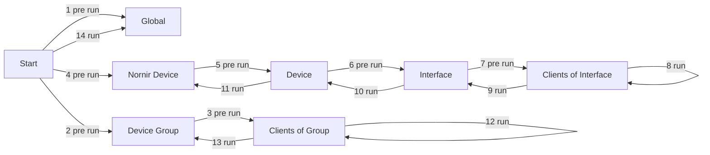

# Providers

Providers act as a template for tasks. They provide functionality and expose configuration parameters through JSON Forms to the user. 

This way, a provider can be written (like a function) in a generic and reusable way, while a task contains configuration which is passed to the provider.

Neops comes with a set of providers out of the box, see [built in providers](https://link)

## Run cycle

The run cycle definition is implemented in each neops provider. Steps can be left empty, but the order is immutable. 

Use __pre run__ and __run__ steps to prepare and execute. 

| #  | Step                            | Description                                                                                                                 |
|----|---------------------------------|-----------------------------------------------------------------------------------------------------------------------------|
| 1  | Pre run on global               | All task arguments are passed                                                                                               |
| 2  | Pre run on device group         | Per device group. Device groups are resolved and passed                                                                     |
| 3  | Pre run on clients of group     | Per client of group. Runs in context of group (here, groups are locations). Device group and client are resolved and passed |
| 4  | Pre run on nornir device        | Per nornir device. Nornir device is resolved and passed                                                                     |
| 5  | Pre run on device               | Per device. Device is resolved and passed                                                                                   |
| 6  | Pre run on interface            | Per interface of device. Device and interface are resolved and passed                                                       |
| 7  | Pre run on clients of interface | Per client of interface. Device, nornir device an dinterface are resovled and passed                                        |
| 8  | Run on clients of interface     | Run equivalent for #7                                                                                                       |
| 9  | Run on interface                | Run equivalent for #6                                                                                                       |
| 10 | Run on device                   | Run equivalent for #5                                                                                                       |
| 11 | Run on nornir device            | Run equivalent for #4                                                                                                       |
| 12 | Run on clients of group         | Run equivalent for #3                                                                                                       |
| 13 | Run on device group             | Run equivalent for #2                                                                                                       |
| 14 | Run on global                   | Run equivalent for #1                                                                                                       |

