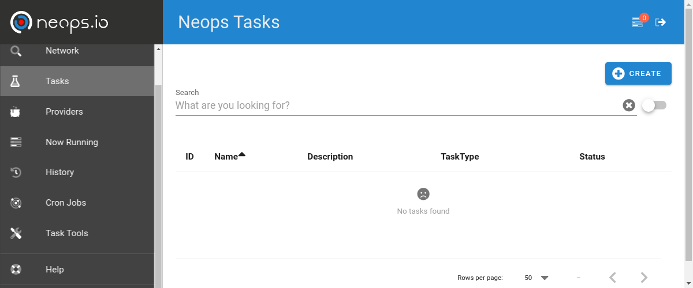
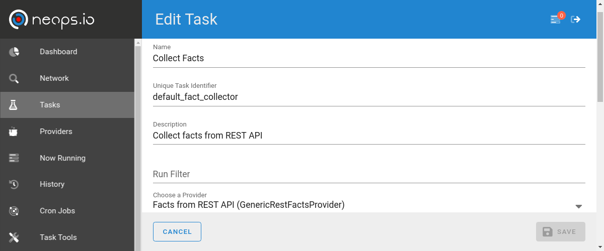
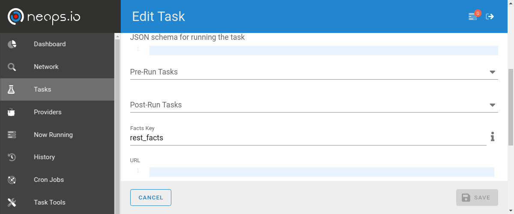
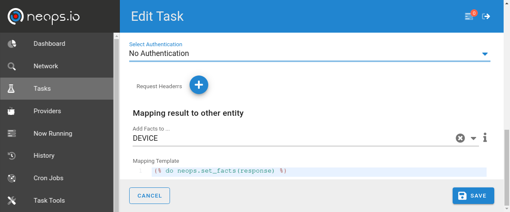
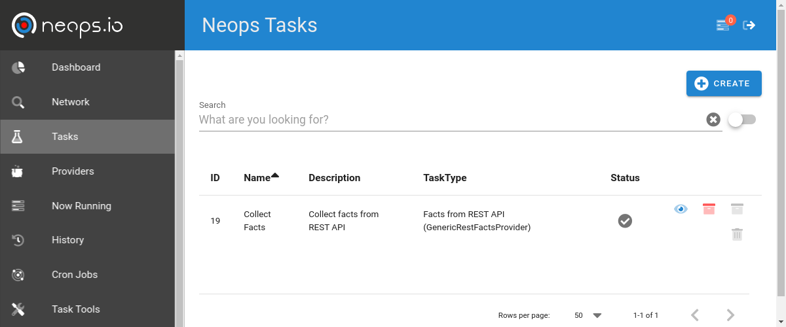
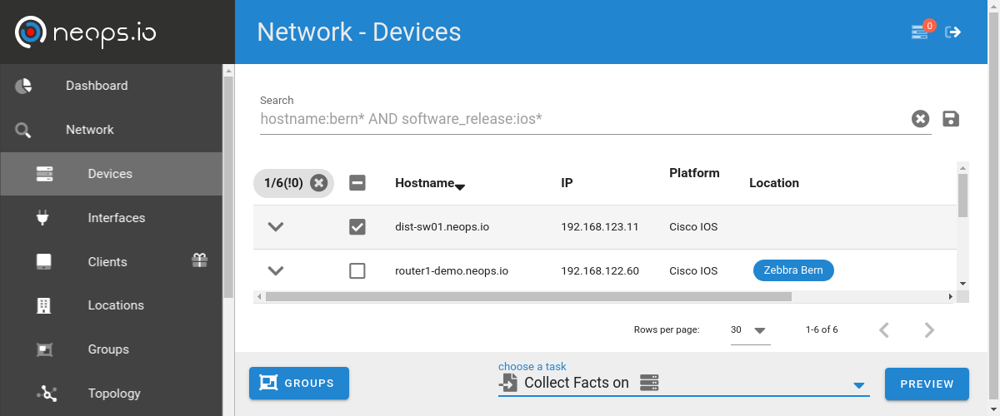
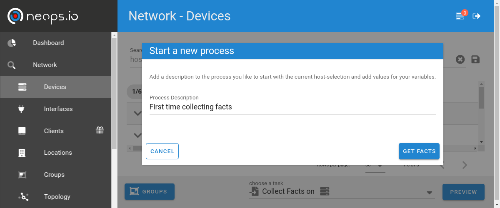

# Tasks

Neops tasks are specific instances of a [neops provider](https://link), which are often very generic. 

A task passes the required configuration to a provider to make it runnable. These requirements are defined in a providers [json schema](https://link) 

## Create new task

To create a new task, navigate to the task menu in the main navigation and click on __create__.

------------

The task form consists of general task fields and specific fields depending on the provider (read more on how to to create your own provider and add form fields using JSON Form )

General task fields:

| Name                   | A human readable name for the task                                             |
|------------------------|--------------------------------------------------------------------------------|
| Unique task identifier | Can be assigned to use the task over our API                                   |
| Run Filter             | Additional filter, using the elastic query style                               |
| Provider               | The provider (will expand the form with dynamic fields from the provider)      |
| Pre run tasks          | Tasks which have to run before this task (see task graph for more information) |
| Post run tasks         | Tasks which have to run after this task (see task graph for more information)  |

<!--  -->

<!--  -->

------------

After saving the task, it will appear in your task list. 

Navigate to your network, and select the elements you want to run the task on.

Select the task in the bottom bar and click on __preview__. Enter a description for the process and start.

You can learn more about how a task is resolved in the provider section.