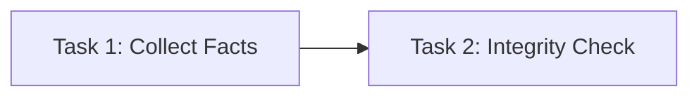
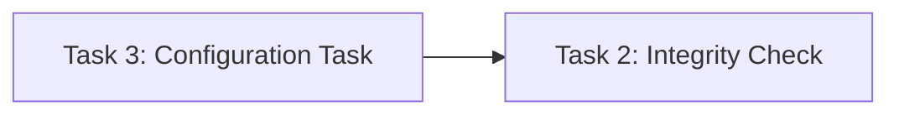
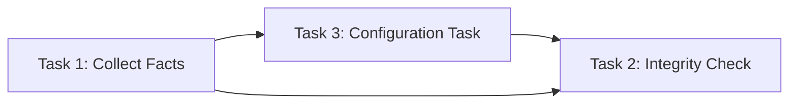
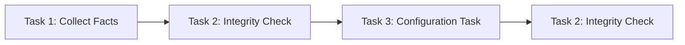
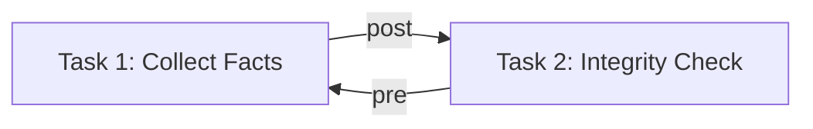
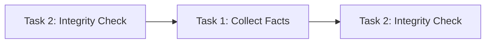
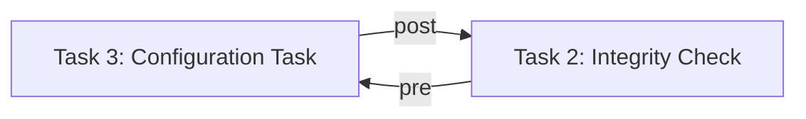
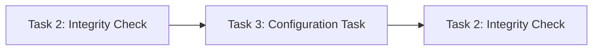
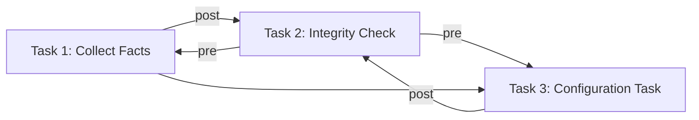
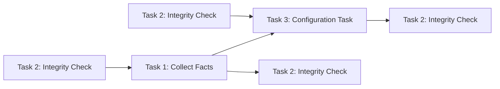

# Pre and post run tasks

Neops tasks can be combined and reused in other tasks by setting them as a **pre run** or **post run** task. The task resolver will then find a valid sequence to run the tasks.

## Task sequencing

Consider the case where you want to run two tasks, and perform an integrity check after each.

### Independent tasks

If the tasks are completely independent, you may run them independently:

And

### Dependent tasks

However, if you have dependencies between 2 or more task, you can specify pre and post run tasks accordingly. 

Here, a dependency of task 1 and task 2 is configured by setting task 1 as a pre run task of task 2.

Which will be sequenced by the task resolver as following:

### Optimize task sequence

Consider an example with pre and post run tasks, similar to the previous. Here, a pre run task is added to task 1 and 2, such that the integrity check is mandatory before a change can occur:

which expands to:

And

which expands to:

Setting Task 1 as **pre run task** of Task 2, the following task graph is produced:

which expands to:

In this example, a sequencing would result in performing the __integrity check__ two times in a row (as we have 2 tasks and 4 integrity checks):

Here, the sequence is optimized, such that no duplicates exist and task definition is fulfilled.

